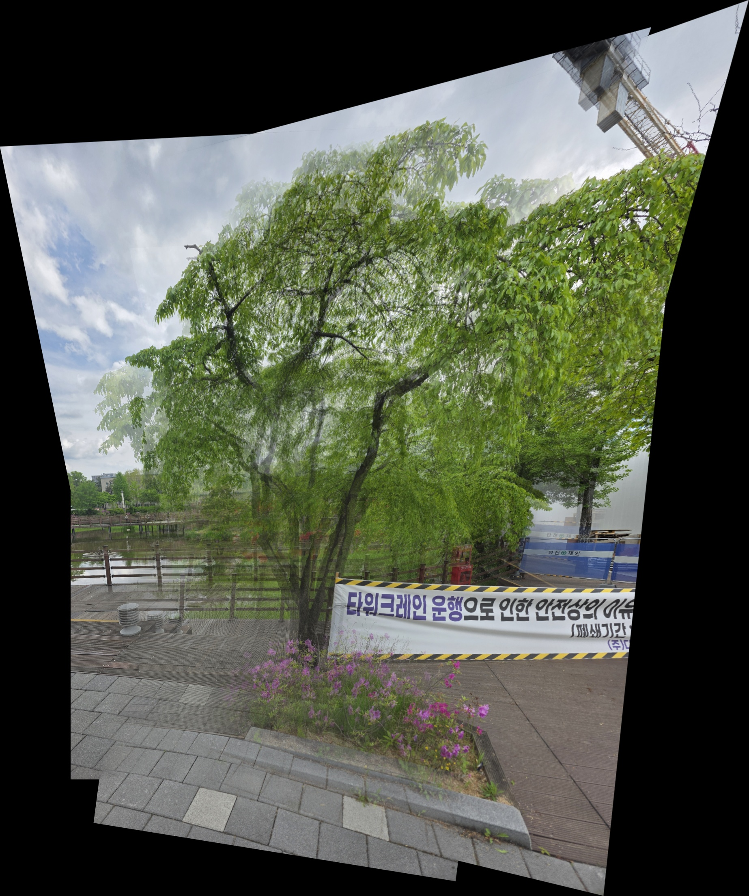

# 📸 Panorama Stitcher (Image Stitching)

본 프로젝트는 여러 장의 겹치는 이미지를 하나의 커다란 파노라마 이미지로 자동으로 정합(Stitching)하는 컴퓨터 비전 프로그램입니다. OpenCV의 내장 high-level API(`cv::Stitcher`)에 의존하지 않고, 특징점 추출부터 호모그래피 계산 및 이미지 와핑까지의 **전체 정합 파이프라인을 직접 구현**하였습니다.

## ⚙️ 요구 사항 (Prerequisites)
본 코드를 실행하기 위해 아래의 파이썬 패키지가 필요합니다.
* `Python 3.x`
* `opencv-python` (`cv2`)
* `numpy`

## 🚀 주요 기능 (Core Features)

* **강인한 특징점 추출 및 매칭 (SIFT & BFMatcher)**
  * 이미지의 크기(Scale)나 회전(Rotation) 변화에도 변하지 않는 강인한 특징점을 찾기 위해 **SIFT 알고리즘**을 사용했습니다.
  * 추출된 128차원의 디스크립터를 Brute-Force Matcher로 비교하고, **Lowe's Ratio Test**를 통해 잘못된 매칭을 걸러내어 확실하고 유효한 매칭점만 선별합니다.
* **호모그래피 행렬 계산 및 투영 (RANSAC & Warping)**
  * 매칭된 특징점 쌍을 바탕으로 **RANSAC 알고리즘**을 활용해 이상치(Outlier)를 제거하고, 두 이미지 간의 최적의 평면 변환(Perspective Transform) 행렬을 계산하여 이미지를 캔버스에 투영합니다.
* **동적 순서 정합 (Unordered Stitching)**
  * 입력된 이미지 파일의 이름이나 순서에 구애받지 않고, 현재 캔버스와 가장 매칭점이 많은 이미지를 알고리즘이 자동으로 찾아 차례대로 이어 붙이는 퍼즐 조립 방식을 구현했습니다.

## ✨ 추가 기능 (Extra Feature): Image Blending
단순히 변환된 이미지를 베이스 캔버스 위에 덮어쓰게 되면, 사진 간의 노출(밝기) 차이나 렌즈 왜곡으로 인해 마치 칼로 자른 듯한 뚜렷한 경계선(Seam)이 남게 됩니다. 이를 해결하기 위해 아래와 같은 블렌딩 기법을 추가로 구현했습니다.

* **적용 기법:** `cv2.distanceTransform`을 이용한 **Feathering (Alpha Blending)** 적용
* **구현 원리:** 각 변환된 이미지의 마스크를 생성한 뒤, 거리 변환(Distance Transform) 알고리즘을 사용해 이미지의 엣지(Edge)에서 중심부로 갈수록 값이 커지는 가중치(Alpha) 맵을 계산했습니다. 두 이미지가 겹치는 영역에서 이 가중치 비율에 따라 픽셀 값을 선형 보간(Linear Interpolation)함으로써, 사진 간의 이음새가 물감처럼 부드럽고 자연스럽게 섞이도록 파이프라인을 고도화했습니다.

## 🖼️ 실행 결과 (Result)
직접 촬영한 6장의 이미지를 하나의 파노라마로 자동 정합한 결과입니다. 블렌딩 기법이 적용되어 다수의 사진이 하나로 매끄럽게 연결된 것을 확인할 수 있습니다.



## 🛠️ 실행 방법 (Usage)
1. 본 파이썬 스크립트 파일(`image_stitching.py`)과 정합하고자 하는 이미지 파일(`.jpg`, `.png` 등)들을 동일한 디렉토리에 위치시킵니다.
2. 터미널(또는 명령 프롬프트)에서 아래 명령어를 통해 프로그램을 실행합니다.
   ```bash
   python image_stitching.py